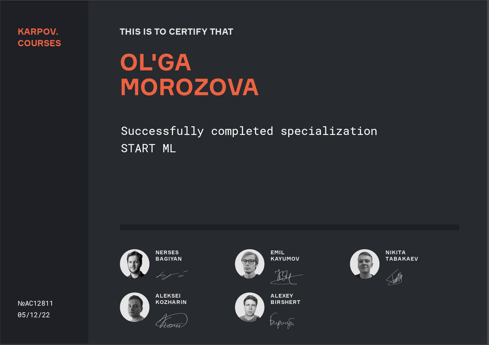

# [Karpov.Courses](https://karpov.courses/startml/programm)

## [2. ПРИКЛАДНАЯ РАЗРАБОТКА НА PYTHON](2.%20ПРИКЛАДНАЯ%20РАЗРАБОТКА%20НА%20PYTHON)
## [3. МАШИННОЕ ОБУЧЕНИЕ И ПРИЛОЖЕНИЯ](3.%20МАШИННОЕ%20ОБУЧЕНИЕ%20И%20ПРИЛОЖЕНИЯ)
## [4. DEEP LEARNING]()
## [5. СТАТИСТИКА И А/В-ТЕСТЫ]()
## [6. Revision]()